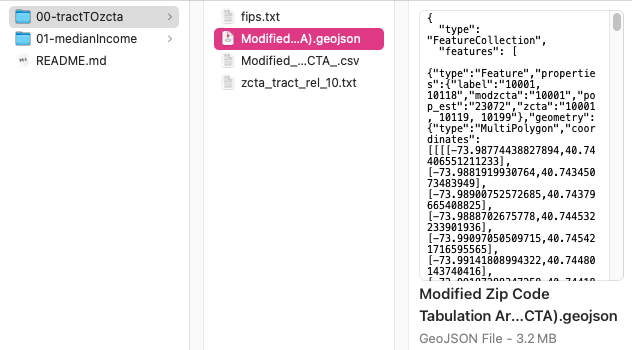

# Data Content

0. `zcta` geojson + relationship from census tract to zcta (`txt`)
1. raw income data (`csv`) + cleaned income data (`csv`)
2. similar for other contents

---

# Directory Tree

.
+-- ...
+-- datas
|   +-- 00-tractTOzata
|   |   +-- fips.txt
|   |   +-- Modified Zip Code Tabulation Areas (MODZCTA).geojson
|   |   +-- Modified_Zip_Code_Tabulation_Areas\__MODZCTA_.csv
|   |   +-- zcta_tract_rel_10.txt
|   +-- 01-medianIncome
|   |   +-- ACS_Median_Household_Income_Variables_-_Boundaries
|   |   |   +-- County_1.csv
|   |   |   +-- State_0.csv
|   |   |   +-- Tract_2.csv
|   +-- ...
+-- ...
+-- scripts
|   +-- 01-clean.py
|   +-- 02-computing.py
|   +-- 03-merging.py

---

# Workflow

0. use [geojson of NYC](00-tractTOzcta/Modified Zip Code Tabulation Areas (MODZCTA).geojson) for mapping
1. use [`fips.txt`](00-tractTOzcta/fips.txt) and `01-clean.py` to select later data (`csv`) for NYC (because downloadable `geojson` files are too large)
2. use [`zcta_tract_rel_10.txt`](00-tractTOzcta/zcta_tract_rel_10.txt) and `03-merging.py` to combine data for tracts in the same zcta area

---